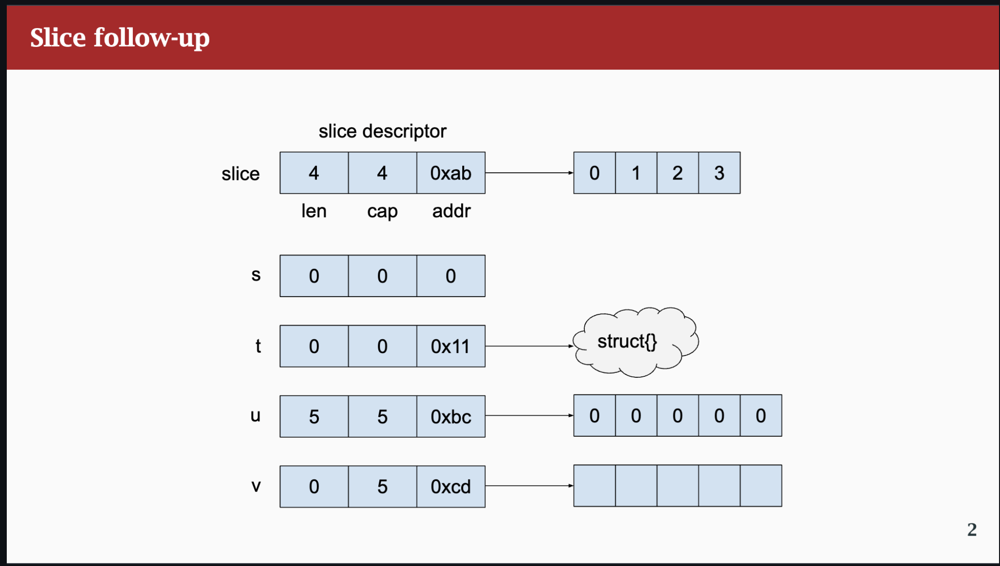

[Cheatsheet](https://ueokande.github.io/go-slice-tricks/)




## Explanation

- **Image 1**: Normal slice

- **Image 2**: nil slice

- **Image 3**: Slice pointing to arbitary object in heap

- **Image 4**: normal slice with correct len and capacity

- **Image 5**: Slice with length 0 and capacity 5

## Encoding

Slices (and maps) encoding differently in JSON when nil

```go
package main

import (
    "encoding/json"
    "fmt"
)

func main(){
    var a []int

    j1 , _ := json.Marshal(a)
    fmt.Println(string(j1)) // null

    b := []int{}
    j2 , _ := json.Marshal(b)
    fmt.Println(string(j2)) // []\
}
```
- When we want to check when slice is empty or not dont compare it with nil either the underlying ds can be nil or unitialized. Best practice

```go
    if len(a) == 0 {

    }
    // This acutally shows whether the item
    // is there or not
```

## Length vs capacity

```go
a := [3]int{1, 2, 3}
b := a[0:1] // b is a slice of a's first item
fmt.Println("a =", a) // a = [1 2 3]
fmt.Println("b =", b) // b = [1]
c := b[0:2] // WTF? but the array has 3 entries
fmt.Println("a =", a) // a = [1 2 3]
fmt.Println("c =", c) // c = [1 2]
fmt.Println(len(b)) // prints 1
fmt.Println(cap(b)) // prints 3
fmt.Println(len(c)) // prints 2
fmt.Println(cap(c)) // prints 3

```

## Slice mutating underlying array

```go
a := [3]int{1, 2, 3}; b := a[0:1]; c := b[0:2]
b = append(b, 4) // grows b, mutates a
fmt.Printf("a[%p] = %v\n", &a, a) // a[0xc000014020] = [1 4 3]
fmt.Printf("b[%p] = %[1]v\n", b) // b[0xc000014020] = [1 4]
c = append(c, 5) // grows c, mutates a
fmt.Printf("a[%p] = %v\n", &a, a) // a[0xc000014020] = [1 4 5]
fmt.Printf("c[%p] = %[1]v\n", c) // c[0xc000014020] = [1 4 5]
c = append(c, 6) // forces allocation!
fmt.Printf("a[%p] = %v\n", &a, a) // a[0xc000014020] = [1 4 5]
fmt.Printf("c[%p] = %[1]v\n", c) // c[0xc000078030] = [1 4 5 6]
c[0] = 9 // mutates a different array!
fmt.Printf("a[%p] = %v\n", &a, a) // a[0xc000014020] = [1 4 5]
fmt.Printf("c[%p] = %[1]v\n", c) // c[0xc000078030] = [9 4 5 6]
```

- You can **append to a nil slice** but not **insert in nil map**