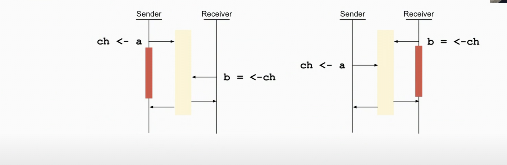
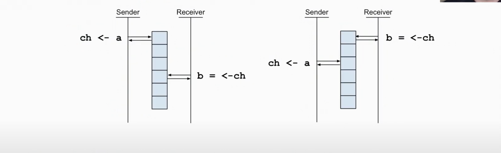

## Channel state

- Channel block unless ready to read write

- A channel is ready to write if 
    - it has buffer space or
    - atleast one reader is ready to read

- A channel is ready to read if
  - it has unread data in its buffer
  - at least one writer is ready to write
  - it is closed 

- Channels are unidrectional , but have two ends which can be passed
seperately as parameters

- An end for **writing and closing**

```go
func get(url string ch chan<-result) { // write-only end

}
```

- An end for reading
```go
func collect(ch <- chan result) map[string]int{ // read-only end

}
```

## Closed Channels

- Closing a channel causes it to return zero value

- We can recieve a second value , if channel closed ?

```go
func main(){
    ch := make(chan int, 1)
    ch <- 1

    b, ok := <-ch
    fmt.Println(b,ok) // 1 true

    close(ch)

    c, ok:= <- chan 
    fmt.Println(c,ok) // o,false
}
```

- A channel can only be closed once (else it will panic)

- One of the main issues with goroutines is ending them

- An unbuffered channel requires a reader and writer 
(a writer blocked on a channel with no reader will leak)

- Closing a channel is often a signal that work is done

- Only one **go** routine can close a channel

- We may need some way to coordinate closing a channel or stopping goroutines 
(beyond the channel itself)

## Nil Channels

- Reading or writing a channel that is nil always blocks

- But a nil channel in a select block is ignore

- This can be powerful tool
    - Use a channel to get input
    - Suspend it by changing the channel var to nil
    - You can even unsuspend it again
    - But close the channel if there is really no more input(EOF)

| State  | Receive   | Send  |Close   |
|---|---|---|---|
| Nil | Block*  | Block*  | Panic  |
|  Empty | Block  | Write  |Close   |
| Partly Full  | Read   | Write  | Readable until empty  |
|  Full | Read  |Block   | Readable until empty   |
|  Closed | Default Value**  | Panic   |Panic   |
| Recieve Only  | OK   | Compile error  | Compile error|
| Send Only  | Compile error   | Ok  |Ok|

* select ignores a null channel since it would always block
** Reading a closed channel returns (default-value, !ok)


## Unbuffered Channels

- By default , channels are unbuffered



- The sender blocks until receiver is ready (and viceversa)

- The send always happens before the receive

- The receive always returns before send

- The sender and receiver are synchronized

- The sender knows the sent is done when the receiver receives.

## Buffered Channel

- Buffering allows the sender to send without waiting



- The sender deposits its item and returns immediately

- The sender blocks only if the buffer is full

- The receiver blocks only if the buffer is empty

- The sender and receiver run independently.

```go
func main (){

// make a channel with buffer that holds two items
messages := make(chan string,2)

// now we can send twice without getting blocked

messages <- "buffered"
messages <- "channel"

// and then receive both as usual
fmt.Println(<-messages)
fmt.Println(<-messages)
}

```

- With buffer size 1 or no buffer at all it will **deadlock** !


- In unbuffered channel , the sender sends data and receiver receives and sender sends finishes.

## Common use of buffered channels

- Avoid goroutine leaks (from an abandoned channel)

- Avoid pauses / blocking (performance improvement)

- Dont buffer until needed **buffering may hide a race condition**

- Testing required to find right number of slots

- Special use of buffered channels
    - Counting semaphore pattern

## Counting Semaphore

-  A counting semaphore limits work in progress (or occupancy)

- Once it is full only one unit of work can enter for each one that leaves

- We model this with a buffered channel
  - attempt to send(write) before starting work
  - the send will block if buffer is full (occupancy at max)
  - receive(read) when the work is done to free up a space in buffer (this allows the next worker to start)

  