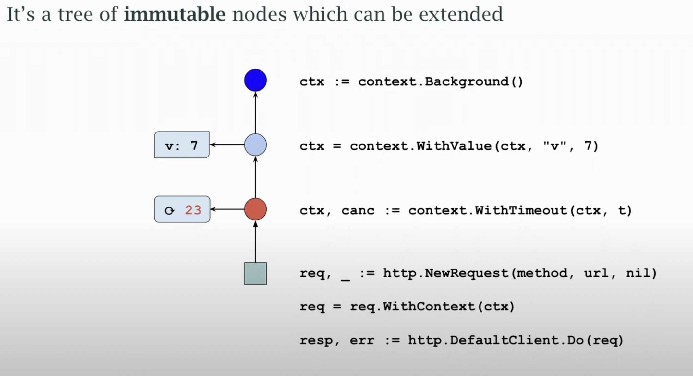

## Cancellation and timeouts

- The Context package offers a common method to cancel requests
    - explicit cancellation (cancel() function)
    - implicit cancellation based on timeout or deadline

- A context may also carry request-specific values such as traceid

- Many networks such as HTTP or database take a context for cancellation

- A context offers two controls
    - a channel that closes when a cancellation occurs.
    - an error that's readable once the channel closes

- The error value tells whether request was cancelled or timed out

- We often use the channel from ``Done()`` in a select block


## Internals

- Contexts form an **immutable tree structure**
(goroutine-safe , changes to a context donot affect its ancestors)

- Cancellation or timeout applies to current context and its **subtree**

- Ditto for a value

- A subtree may be created with shorter timeout but not longer



Example

```go
func First(ctx context.Context, urls[]string)(*Result,error){
    c := make(chanResult , len(urls))

    ctx , cancel := context.WithCancel(ctx) // Derive context that is cancellable from parent context

    defer cancel() // Cancel other req when queries done

    search := func(url string){
        c <- runQuery(ctx ,url)
    }
}

```

- Convention pass context as first params

## Values

- Context values should be data specific to a request such as 
 - a traceID or start time for latency calc
 - security or authorization data

- Avoid using context to carry optional params

- Use a package specific , private context key type (not string) to avoid collisions.

## Private Context key

```go
type contextKey int

const TraceKey contextKey = 1

func AddTrace(){
    ctx = context.WithValue(ctx ,TraceKey,traceID)
}

```
## Context usage

```go
func Log(ctx context.Context f string, args ... {}interface){

    traceID , ok := ctx.Value(TraceKey). (string)

    if ok && traceID = ""{
        // Do
    }
    }

```