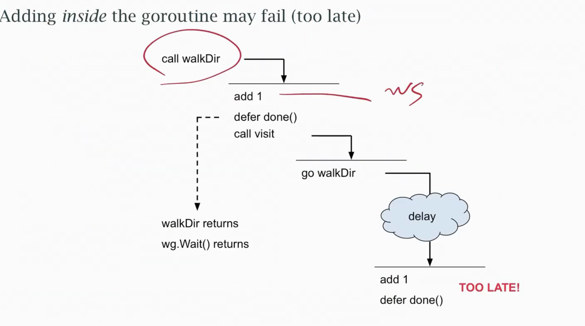

# Concurrency problems

## Race condition

- When unprotected reads and write overlap
- Must be some data that is written to
- Could be a read modify operation
- And two goroutines can do it at same time

## Deadlock

When no goroutine can make progress

- goroutines could all be blocked on empty channels
- blocked waiting on a mutex
- gc could be prevented from running

Go detects some deadlocks automatically; with -race it can find some data races

## Gorountine Leak

- Hangs on a empty or blocked channel
- not deadlock; other goroutines make progress
- often found by looking at ``pprof`` output

Callers responsibility to know how/when it will end

## Channel errors

- Trying to send on a closed channel
- Trying to send or receive on a nil chanel
- closing a nil channel
- closing a channel twice

## Others

- closure capture
- misuse of Mutex
- misuse of WaitGroup
- misuse of select

## Deadlock example


```go
func main(){
    ch := make(chan bool)

    go func (ok bool){
        if ok {
            ch <- ok // this will pass so no writer
        }
    }(false)

    <- ch // waiting for something to read from
}

```
- Compilers detect deadlock

- Always acquire mutex in a particular order

In this example a timeout leaves the goroutine hanging forever the correct sol is to make a buffered channel

```go
func finishReq(time time.Duration) *obj {
    ch := make(chan obj)

    go func (){
        ch <- fn() // blocking send
    }

    select {
        case rslt := <-ch:
            return rslt
        case <- time.After(timeout):
            return nil
    }
}

```

- Always call ``wg.Add()`` before go ``wg.Done`` or ``wg.Wait()`` 



## Closure capture

- A goroutine closure shouldn't capture a mutating varible

```go
for i:=0 ; i < 10; i ++ {
    go func(){
        fmt.Println(i) // WRONG
    }
}

```
- Instead pass the variables value as parameter

```go
for i := 0 i < 10; i++{
    go func(i int){
        fmt.Println(i)
    }(i)
}
```

## Select problems

- default is always active
- a nil channel is always ignored
- a full channel (for send) is skipped over
- a done is just another channel (Can use context cancellation)
- available channels are selected at random (if two things are ready at same time and they are to be ordered execution then issue)

## 1 : skipping a full channel to default and losing a message

```go
for {
    x := socket.Read()

    select {
        case output <- x:
        // 
        default:
            return
    }
}

```
- The code was written assuming we'd skip output only if it was set to nil

- We also skip if output is full and loss this and future messages

## 2 Reading a done channel and aborting when input is backed up with another channel  - the input is lost

```go
for {
    select {
        case x := <- input:
        //
        case <- done:
            return
    }
}
```
- There's no guraantee we read all of input before reading done

- Better use done only for an error or abort , close input on EOF

## Summary

- Don't start a goroutine without knowing how it will stop

- Acquire locks/semaphores as late as possible; release them in reverse order

- Don't wait for non parallel work that you could do yourself

```go
func do() int {
    ch := make(chan int)
    go func() {ch <-1 }()
    return <- ch
}

```