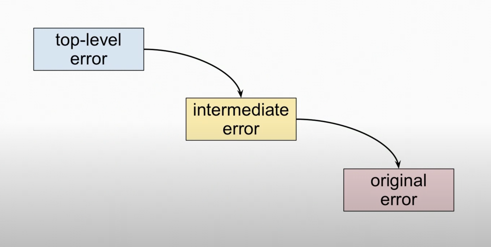

## Simple errors

Most of the time, errors are just strings

```go
func (h HAL) OpenDoors() error {
    if h.kill {
        return fmt.Errorf("cant open %s",h.victim)
    }
}
```

## Error types

Errors in Go are objects satisfying the error interface

```go
type error interface {
    Error()string
}

```

- Any concrete tpye with ``Error{}`` can represent and error

```go
type Fizgig struct{}

func (f Fizgig) Error() string {
    return "it is bent"
}
```

## A custom error type

- We are going to build out custom err type

```go
type errKind int

const (
    noHeader errKind = iota // so we start at 1
    cantReadHeader
)

type WaveError struct {
    Kind errKind
    value int 
    err error
}


fun (e WaveError) Error() string{
    switch e.Kind {
        case noHeader:
            return "no header"
        case cantReadHeader:
            return "cant read header"
    }
}
```

## Wrapped errors

- We can wrap one error in another
- The eaiset way to do is to use ``%w`` format verb with ``fmt.Erorrf()``



- Customer error types may now unwrap their internal errors

```go
func (w*WaveError) Unwrap() error {
    return w.err
}

```

## errors.Is
- We can check whether an error has another error in its chain

- ``errors.Is`` compares with error variable not a type

```go
if errors.Is(err, o.ErrPermission){
    // let's report a security violation
}

```

- We can provide the Is() method for our customer type

```go
func (w*WaveError) Is(t error) bool {
    e, ok := t. (*WaveError) // reflection again
    if !ok {
        return false
    }
    return e.errKind == w.errKind
}
```

## errors.As

- We can get an error of an underlying type , if it is in the chain

- ``errors.As`` looks for an error type not a value

```go
if audio, err := Decode(fn); err != nil {
    var e os.PathError

    if errors.As(err , &e){
        // pass beack the underlying file error
        return e
    }
}

```

## Errors in Go

When it comes to we may fall into one of these camps

- Hate constantly writing if/else blocks
- Writing if/else block makes things clear
- Don't care because too busy writing code

## Normal errors

- **Normal** erros result from input or external condition (for example , a file not found error)

- Go code handles this case by returning the ``error`` type

## Abnormal errors

- **Abnormal** errors result from invalid program logic

For program logic errors, Go code does a ``panic``

```go
func (d*digest) checkSum() [Size]byte {
    if d.nx != 0 { // panic if there's data leftover
        panic("d.nx != 0")
    }
}

```

## When your program has logic bug

- If your server crashes it will get immediate attention
    - logs are often noisy
    - so proactive log searches for problems are rare

-  We want evidence of the failure as close as possible in time and space to original defect in code
     - connect the crash logs that explain the context
     - traceback from the point closes to the broken logic

- In a distributed system , crash failures are safest type to handle
    - It is better to die than to be a zombie or  bubble or corrupt the DB
    - not crashing may lead to Byzantine failures

## When we should use panic?

- Only when the error was caused by our own programming defect , eg 
    - we can't walk as DS we built
    - we have an off by one one encoding bytes bug

> panic should be used when our assumptions of our own programming design or logic are wrong

- These cases might use an assert in other programming languages

## Exception handling

- Exception handling was popularied to allow ""graceful degradation"" of safety-critical systems

- Exception handling introduces invisible control paths through code

- So code with exceptions is harder to analyze (automaitcally or by eye)

- ``panic`` in a function will still cause deferred function calls to run 

- Then it will stop only if it finds a valid  ``recover`` call in a defer as it unwinds the stack.

## Panic and recover

```go
func abc(){
    panic("omg")
}

func main(){
    defer func (){
        if p := recover(); p != nil { // if panic present
                fmt.Println("recover: ",p)
        }
    }()

    abc()
}
```
- Use case in unit tests , Don't bring excepting handling pattern of other languages in Go

## Define errors out of existence

Error (edge) cases are primary source of complexity

**The best way to deal with many errors is make them impossible**

Design your abstractions so that most (or all) ops are safe

- reading from a nil map

- appending to a nil slice

- deleting a non existant item from a map

- taking the len of uninitalized string

Try to reduce edge cases that are hard to test debug or even think about

## Proactively prevent problems

- Every pice of data in your software should start life in a valid state

- Every transformation should leave it in a valid state
    - Break large programs into small pieces you can understand
    - hide information to reduce the chance of corruption
    - avoid clever code and side effects
    - avoid unsafe operations
    - assert your invariants
    - never ignore errors
    - test , test
    - never accept input from user or environment without validation

    