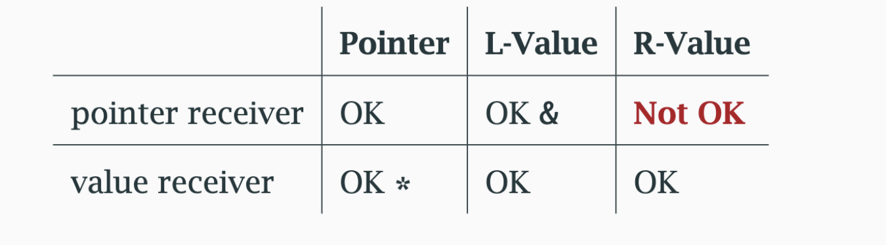

# Nil interface 

- An interface variable is **nil** until initialized

- It has two parts
   - A value or pointer of some type
   - a pointer to type info so that the actual method can be defined

```go
var r io.Reader // nil until initialized
var b *bytes.Buffer  // diiot

r = b  //  r is not nil 
     // but it has a nil pointer to buffer
```

- An interface var is nil if only both are


# Error is really an interface

- We call error  a special type but it is really an interface

```go
type error interface {
    func Error() string
}
```
- We can compare it to nil unless we make a mistake

- The mistake is to store a nil pointer to a concrete type in the error variable.

```go
type errFoo struct {
    err error
    path string
}

func (e ErrFoo) Error() string{
    return ""
}

func XYZ(a int )*errFoo {
    return nil
}

func main (){
    var err error = XYZ(1) // BAD: interface gets a nil concrete ptr

    if err != nil {
        fmt.Println("oops")
    } else {
        fmt.Println("ok")
    }
}
```

Fix 

```go

func XYZ(a int ) error { // error interface
    return nil
}
```

- We need to return nil to an inteface instead of concrete type

## Pointer vs value receivers

 - A method can be defined on a pointer to a type 

 ```go
type Point struct {
    x, y float32
}

func (p*Point) Add(x,y float32){
    p.x , p.y= p.x+x , p.y+y
}

func (p Point) Offset(p1 Point) (x float32,y float32){
    x,y = p.x-p1.x, p.y-p1.y
}
```
- The same method may not be bound to T and *T

- Pointer methods may be called on non-pointers and viceversa

- Go will automatically use * or & as needed

```go
p1 := new(Point) // * Point , at (0,0)
p2 := Point{1,1}

p1.OffsetOf(p2) // same as (*p1).OffsetOf(p2)
p2.Add(3,4) // same as (&p2).Add(3,4)

```
- Except and may only be applied to objects that are addressable

Compatibility between objects and receiver types



 - A method requiring a pointer receiver may only be called on addressable object

```go
var p Point
p.Add(1,2) // OK , &p
Point{1,1}.Add(2,3) // Not OK , can't take address
```

# Consistency in receiver types 

- If one method of a type takes a pointer receiver then all its methods should take pointers*

- And in general object type are probably not safe to copy

```go
type Buffer struct {
    buf []byte
    off int
}

func (b*Buffer) ReadString(delim byte) (string,error){

}
```

## Currying functions

- Currying takes a function and reduces it args count by one (one arg gets bound and new function is returned)

```go
func Add(a,b int) int {
    return a+b
}

func AddToA(a int) func(int)int {
    return func (b int) int {
        return Add(a,b)
    }
}

addTo1 := AddToA(1)
fmt.Println(Add(1,2) == addTo1(2))
```

# Method values

- A selected method may be passed similar to a closure the reciever is closed over at that point

```go
func (p Point) Dist(q point)float64{
//........
}

p := Point{1,2}
q:= Point{4,6}

distanceFromP := p.Distance // this is a method value

fmt.Println(distanceFromP(q)) // and call be called later
```

## Reference and value semantics

- A method value with a value receiver copies the receiver

- If it has a pointer receiver it copies a pointer to the receiver

```go
func (p*Point) Distance(q Point) float64{}

p := Point{1,2}
q := Point{4,6}

distanceFromP = p.Distance
p = Point{3,4}

fmt.Println(distanceFromP(q)) // use new value of p
```

# Interfaces in practice

- Let consumers define Interfaces
(what minimal behaviour they require?)

- Re-use standard Interfaces when possible

- Keep interface declarations small (The bigger interface the weaker abstraction)

- Compose one or more interfaces into larger interface (if needed)

- Avoid coupling interfaces to particular types/implementation.

- Accept interface but return concrete types (let the consumer of return type decide how to use it)

``` Be liberal in what you accept and conservative in what you return```

- Put least no of restrictions on params we accept (the minimal interface)

- Dont require ReadWriteCloser if you only need to read

- Avoid restricting use of return type (the concrete value you return fit in many interfaces)

- Returning *os.File is less restrictive than returning io.ReadWriteClose because file have other useful methods

## Empty Interfaces

- The interface {} type has no methods

- Empty interfaces are commonly used

- Reflection needed to determine what the concrete type is

## Additional Reading

[Internals of interfaces](https://research.swtch.com/interfaces)