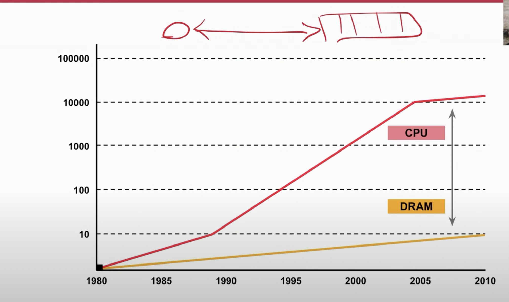
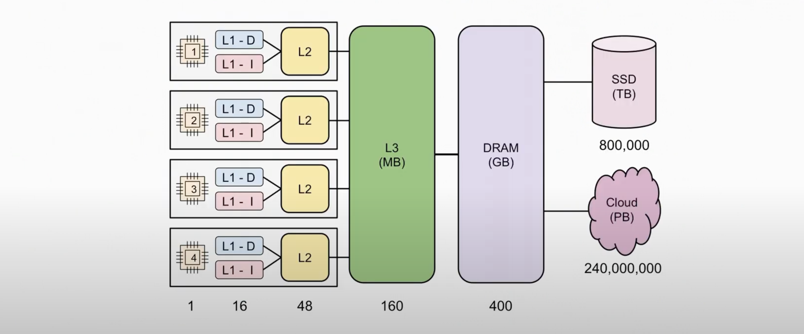
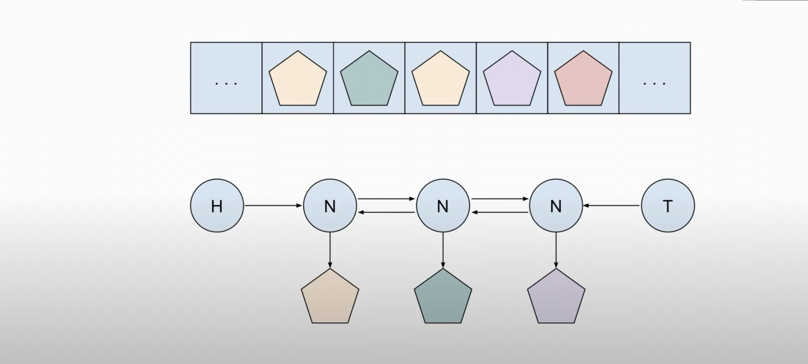
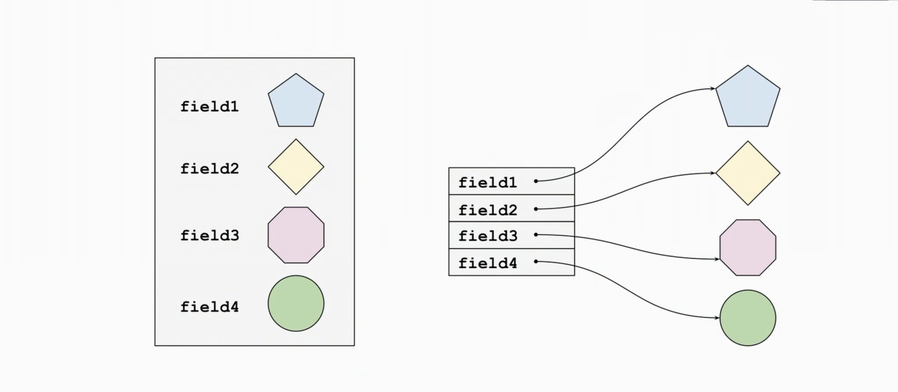
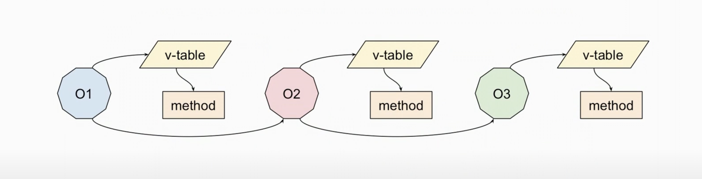
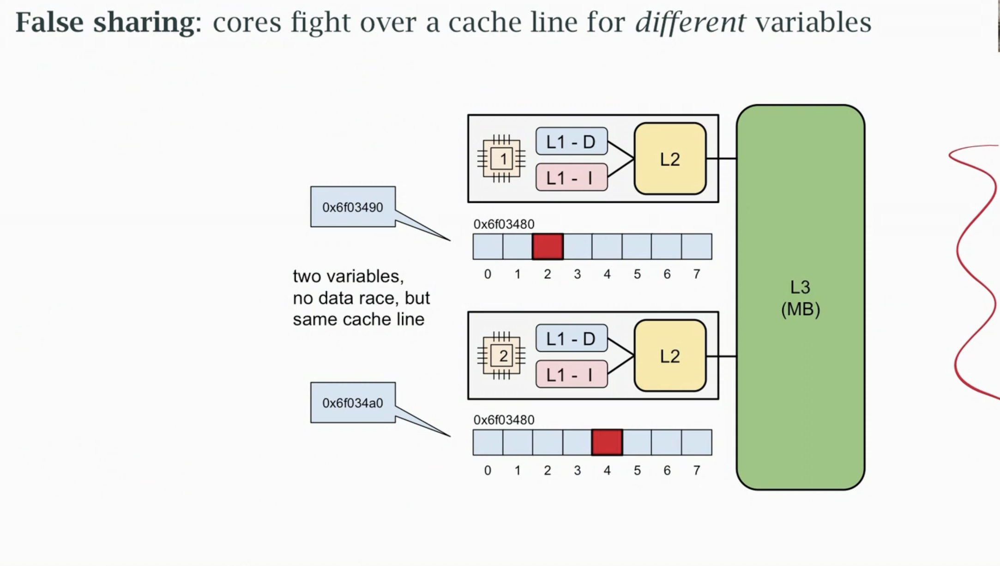

# Performance in Cloud

- We made a deliberate choice to accept some overhead

- We have to tradeoff performance against other things
    - choice of architecture
    - quality,reliability, scalability,
    - cost of developement & ownership

- We need to optimize where we can, given those choices

- We still want **simplicity,readability & manitainability** of code

## Optimization

Top down refinement

- **Architecture** - Latency , cost of communication

- **Design** - Algorithms, concurrency, layers

- **Implementation**- Programming lang , memory use

- Mechanical sympathy plays a role in our implementation

- Interpreted languages may cost 10x more to operate due to their inefficiency.

- Interpreted languages abstract the machine from us

Some unfortunate realities

- CPUs aren't getting faster any more

- The gap between memory and CPU is'nt shrinking

- Software gets slower more quickly than CPU gets faster.

## Mechanical Sympathy

- Maintain or improve the performance of software

- Control the cost of developing software

The only way to do that is

 - Makes software simple
 - **Make software work with machine** , not against it

 - As memory capcity increases, access latency also increases

- The above is ``x86`` design

- The number below is the access latency.

## Memory Caching

- Computational cost is often dominated by **memory access cost**

- Caching takes advantage of access patterns to keep frequently-used
code and data close to the CPU to reduce access time.

- Caching imposes cost of its own
    - Memory access by the cache line typically 64 bytes
    - Cache coherency to manage cache line ownership (Synchornization of levels)

## Locality

**Locality in Space** - Access to one thing implies access to another nearby

**Locality in Time** - Access implies we are likely to access it again soon

Caching hardware and performance benchmarks usually favor large scale number crunching problems where software uses optimal use of cache.

## Cache efficiency

- Caching is effective when use (and reuse) entire cachelines.

- Caching is effective when we access memory in predicatble patterns
(but only sequential access is predictable)

We get our best performance when we 

- Keep things in contigous memory
- Access them sequentially

## Things that make the cache less efficient
- Synchornization between CPUS

- Copying blocks of data around in memory

- Non-sequential access patterns (calling functions,chasing pointers)

A little copy is better than lot of pointer chasing!

## Things that make cache more efficient

- Keeping code or data in cache longer

- Keeping data together (so all of cacheline is used)

- Processing memory in sequential order (code or data)

## Access patterns

- A slice of objects beats a list with pointers

-  A struct with contigous fields beat class with pointers

- Calling lots of methods via dynamic dispatch is expensive

- The cost of calling a function should be propotional to the work it does

## Synchronization costs

- Synchronization has two costs
    - the actual cost to synchronize (lock & unlock)
    - The impact of contention if we create a **hotspot**

- In worst case synchornization can make the program sequential

**Amdahl's law**
Total speed up is limited by the fraction of program that runs sequentially

## False sharing

## Other costs

- There are other hidden costs
    - Disk access
    - Garbage collection
    - Virtual memory and its cache
    - Context switching between process

-  The only one we can control is Garbage collectoor
    - Reduce unecssary allocations
    - Reduce embedded pointers in objects
    - pardoxically, want a larger heap

Go encourages good design, We can choose to

- Allocate contigously
- to copy or not copy
- to allocate on stack or heap (sometimes)
- to be synchornous or asynchornous
- to avoid unnecessary abstraction layers
- to avoid short/ forwarding methods
