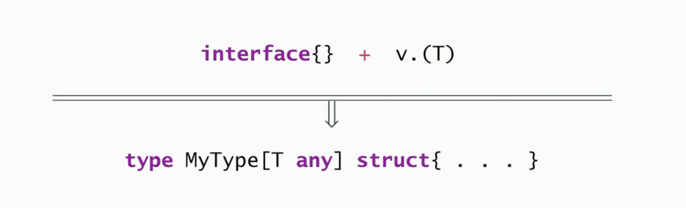

## Generics

- Generics is shorthand for ``parametric-polymorphism``

- This means that we have ``type param(T)`` on a type or a function

```go
type MyType[T any] struct {
    v T // can be any valid go type
    n int
}
```

- Generics are powerful feature of abstraction

- And possible source for unnecessary abstraction and complexity

## When to use generics

- Use type params to replace ```dynamic typing``` with ```static typing```



- If it runs faster that is considered a bonus

- Continue to use (non-empty) interfaces when possible

- Performace should not be typical principle for generics