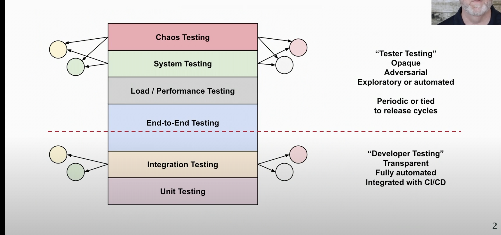

## Go test features

- Go has standard tools and conventions for testing

- Test files end with ``_test.go`` and have ``TestXXX`` functions
(they can be in package directory on in aseerate directory)

- We can run tests with go test

```
go test ./...

ok xyz/test 56.841s
ok xyz/pkg/acedb (cached)
```

Tests are not run if the source wasnt changed since the last test

## Common things to test for

- extreme values

- input validation

- race conditions

- error conditions

- boundary conditions

- pre and post conditions

- randomzied data

- configuration & deployment

- interfaces to other software

**Unit testing** - Unit testing is self contained and doesn't need any external
dependencies to be included (database ,microservice), just need to test whether the parts that are in our control work correctly and handled correctly.

**Integration testing** - Typically runs in CI/CD and communicates with MS

## Test functions

Test functions have the same signature using ``testing.T``

```go
func TestCrypto(t*testing.T){
    uuid := "foo"
    key :="bar"
    key2 := "foo"

    ct , err := secrets.MakeAppKey(key,uuid)
    if err != nil {
        t.Errorf("make failed: %s",err)
    }
}
```
- Errors are reported through param t and fail the test

## Table driven tests

 Tests just in a range of values

 
